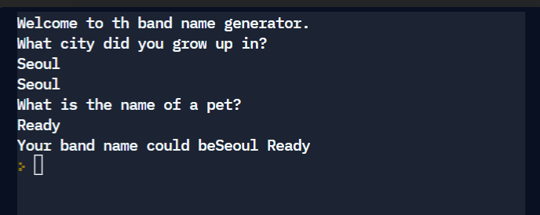

# 🚀 band-name-generator-start

### 1일차 프로젝트_ 밴드명 생성기 

```python
#1. Create a greeting for your program.

#2. Ask the user for the city that they grew up in.

#3. Ask the user for the name of a pet.

#4. Combine the name of their city and pet and show them their band name.

#5. Make sure the input cursor shows on a new line, see the example at:
#   https://replit.com/@appbrewery/band-name-generator-end
```


---


*  **Create a greeting for your program.**

```python
print("Welcome to th band name generator.")
```


* **Ask the user for the city that they grew up in.**

```python
city = input("What city did you grow up in?\n")
print(city)
```


* **Ask the user for the name of a pet.**

```python
pet = input("What is the name of a pet?\n")
```


* **Make sure the input cursor shows on a new line, see the example at:**

```python
print("Your band name could be" + city + " " + pet)
```


----



