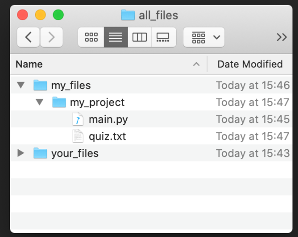

### 🤔 **Quize1 : 실력 테스트** 

(1) print(len("95637+12")) 가 출력하는 값은? = **8**


(2)아래의 코드를 확인하세요. 결과로 출력되는 값은 무엇일까요? = **C**

```python
score = 67
if score < 80 and score > 70:
    print("A")
elif score < 90 or score > 80:
    print("B")
elif score > 60:
    print("C")
else:
    print("D")
```


(3) 콘솔에 출력되는 값은 무엇일까요? = **NameError**

```python
def a_function(a_parameter):    
    a_variable = 15    
    return a_parameter 
a_function(10)
print(a_variable)
```


(4) 출력되는 값은 무엇일까요?  = **15**

```python
def outer_function(a, b):
    def inner_function(c, d):
        return c + d
    return inner_function(a, b)
 
result = outer_function(5, 10)
print(result)
```


(5) `Car` 클래스의 속성과 메소드는 다음과 같습니다. 답변에서 오류가 발생하는 코드는 무엇일까요?

**= car.break = 0**

**Attributes:**

```python
num_of_seats
speed
```

**Methods:**

```python
drive()
break()
```


(6) `my_toyota` 와 `my_fiat` 를 설명하는 단어는 무엇일까요? = **객체 object**

```python
my_toyota = Car()
my_fiat = Car()
```


(7) **main.py** 파일에서 코드를 작성해 **quiz.txt** 파일을 여는 경우 **상대** 파일 경로는 무엇일까요?

**= "quiz.txt"**




(8) 아래의 코드가 출력하는 값은 무엇일까요? = **20, 4, 12**

```python
def foo(a, b=4, c=6):
    print(a, b, c)
 
foo(20, c=12)
```


(9) 위의 코드가 출력하는 값은 무엇일까요?

= **4 (7, 3, 0) {'x':10, 'y':64}**

```python
def all_aboard(a, *args, **kw): 
    print(a, args, kw)
 
all_aboard(4, 7, 3, 0, x=10, y=64)
```


(10) 다음 코드가 출력하는 값은 무엇일까요? 컴퓨터로 계산할 필요는 없습니다.

```python
numbers = [1, 1, 2, 3, 5, 8, 13, 21, 34, 55]
result = [num + 3 for num in numbers if num % 2 == 0]
print(result)
```

 = **[5, 11, 37]**

