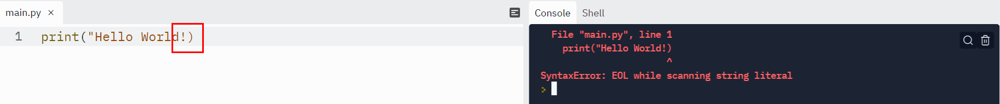

# 🚀 section1_파이썬 변수를 사용한 데이터 관리


### 4. 1일차 목표 : 오늘 작업에 대하여 

* 과정 끝에 '밴드 이름 생성 프로그램 만들 예정' 😊

**📌 band-name-generator-end.appbrewwery.repl.run**

(1) `welcome to the band name generator.`

`what's name of the city you grew up in?`  = Bristol

(2) `what's your pet's name?` = Rabbit

(3) `your band name could be Bristol Rabbit`

---


### 5. 파이썬에서 콘솔에 출력하는 방법 

📌 **repl.it/@appbrewery/day-1-printing-start**


**@ repl : 과정 동안 작성한 모든 코드에 대한 기록 역시 확인이 가능하다.** **(무료)**


👉 print() : ()안에 출력할 문구를 작성하면 코드가 실행 될때 이 괄호 안의 것을 출력

```python
print("Hello World!")

# Hello World 출력
```


> print () function 
>
> print("somthing")
>
> somthing => output

> "___" 따옴표를 사용하는 이유 : ()괄호 안의 내용은 프로그래밍 코드가 아니라는 것을 알려주기 위한 표시 
>
> "___" 큰 따옴표의 역할 : 문자의 시작과 끝을 표시
>
> 이러한 형태의 텍스트를 프로그램이 용어로 문자열(stringS) 이라고 한다. 
>
> EX)  진주 목걸이 : **글자들의 연속적인 집합**


만약 따옴표가 없다면 다음과 같은 문법오류가 발생한다. 모든 프로그래머스들은 실수를 한다. 하지만 

훌륭한 프로그래머임을 구분하는 것은, **우리가 문제가 무엇이고 어떻게 고쳐야 하는지를 잘안다는 것!**




* 문제 해결 방법 : 오류 코드에 대해 검색해보기_ 우리들이 읽어야 할 오류를 읽을 줄 알아야 한다. 


: **stackoverflow** 이곳은 모든 개발자들이 자신의 프로그램 코드에 문제가 생겼거나 무너가 일이 발생했는데 이게 무엇인지 모를때 q&a를 올리는 곳 


##### 💁‍♀️ 훌륭한 프로그래머


---


### 6. [대화형 코딩 연습] 출력

#### Example Output

After you have written your code, you should run your program and it should print the following:

`Day 1 - Python Print Function`

`The function is declared like this:`

`print('what to print')`

e.g. When you hit **run**, this is what should happen:


**🔥 day-1-1-exercise** 

```python
print("Day 1 - Python Print Function") #복붙보다 직접 타이핑 하기 
print("The function is declared like this:") # 따옴표에 대한 오타 주의 
print("print('what to print')") #작은 따옴표를 왜 사용하는지 고민해보기 

# print("print("what to print")") 작은 따옴표 대신 큰따옴표를 사용하게 된다면?
# 코드가 뒤죽박죽 되며 오류가 발생한다_ invalid syntax
# 프로그래밍 코드는 문자열의 끝이 what to print 이 시점이라고 생각하게 된다. 
# 다음과 같이 인식하고 해석한다. 
# 따라서 오류없이 작성하는 방법은 2가지이다. 
# 첫번째 ("print('what to print')")
# 두번쨰 ('print("what to print")'')
```

> 

---


### 7. 문자열 처리와 지능형 코드

**(1) 개행 문자   \n**

```python
print("Hello World!\nHello World!")

# 출력 : 
#Hello World!
#Hello World!
```

**(2) 문자열 결합**

```python
print("Hello" + "su")

# 둘 사이에는 공백 문자를 넣지 않았기 떄문에 공백이 없다. 
# 출력 : Hellosu

# 그렇다면 어떻게 공백을 넣어야 할까? 
print("Hello" + " " + "su") 
# 코드 중간에 추가하는 공백 = 편의상 공간 
# 문자열을 연결된 글자의 집합체로 생각한다면 _ 진주목걸이 생각해보기 
# 문자열 결합은 서로 다른 문자열을 하나로 합치는 것이라고 생각할 수 있다. 
# 따라서 파이썬에서는 공백에 대한 공간이 중요하다. 다음은 코드 공백 주의사항에 대한 것이다. 
# print 앞 실수로 공백 또는 탭을 넣으면 indentatioinerror : unexpected indent 오류가 발생한다. 
# 들여쓰기 오류_ 오류가 발생한 위치를 확인한 후 스택 오버플로우를 찾거나 이 오류가 무엇을 의미하는지 기억한 뒤 코드를 수정하면, 처리 가능하다. 
# indentatioinerror : unexpected indent = 들여쓰기 오류 
```

---


### 8. [대화형 코딩 연습] 디버깅 연습


**🐞디버깅**  : 1980년대 초기 컴퓨터 사이로 나방 한마리가 들어갔는데 프로그래머와 나방  모두에게 불행하게도 이 나방이 감전이 되어 컴퓨터 오류가 발생하였고 예상한 대로 작동하지 않았던 것에서 유래합니다. 그래서 프로그래머가 실제로 컴퓨터 안으로 가서 나방을 골라내고 다시 작동하도록 고쳐냈다. 

💁‍♀️ **우리가 할일** : **오류를 찾아내서, 예상하는 대로 실행시키고 오류가 없게끔 유도하는 것**


#### Example Output

When you run your program, it should print the following:

> Day 1 - String Manipulation
> String Concatenation is done with the "+" sign.
> e.g. print("Hello " + "world")
> New lines can be created with a backslash and n.

e.g. When you hit **run**, there should be no errors and this is what should happen:


**🔥 day-1-2-exercise** _ 잘못된 코드 수정하기 


```python
# 수정 전
print(Day 1 - String Manipulation")

# 수정 후 
print("Day 1 - String Manipulation")
      
# * 발견된 오류 1 : file "python", line 3 (3행에서 오류 )
#print(Day 1 - String Manipulation")  / SyntaxError: invalid syntax
```

```python
# 수정 전 
	print("e.g.print(Hello + world)"))

# 수정 후 
print("e.g.print(Hello + world)"))

# File "main.py", line 5 (5행에서 오류 발생)
    #print("e.g.print(Hello + world)")) 
    ^
#IndentationError: unexpected indent (들여쓰기 오류)
```

```python
# SyntaxError : unexpected EOF while parsing 
# 검색하여 스택 오버플로우에서 확인해보기 
# 결과 : 모든 코드 블록이 완료되기 전에 소스 코드의 끝에도달했다고 한다. 
# 코드 블록이 무엇인가? print가 있는 곳 _ 시작점과 끝점 
# print((_______________) : 괄호가 제대로 닫히지 않은 경우 

# 수정 전 
print(("New lines can be created with as backslash and n.")

# 수정 후
print("New lines can be created with as backslash and n.")
```

```python
# 덧셈 기호가 공백으로 바뀜
# 출력 : String Concatenation is done with the  sign
# 출력 오류는 더이상 없지만 예상한 문자열과 실제 출력이 맞지 않음을 확인
# 우리가 해야할 것 : 큰 따옴표에서 작은 따옴표로 바꾸기 
# = 덧셈기호를 포함하여 모든 문자열이 같은 색으로 표시 

# 수정 전 
print("String Concatenation is done with the "+" sign")

# 수정 후 
print('String Concatenation is done with the "+" sign')
```

> 🐞**오류 정리** 
>
> (1) Missing double quotes before the word Day.
>
> (2) Outer double quotes changed to single quotes.
>
> (3)  Extra indentation removed.
>
> (4) Extra ( in print function removed.

---


### 9. 파이썬의 입력 함수

* 입력함수에 대해 배웠으며, 다른 함수에 함수를 넣고, 입력 함수를 이용하여 콘솔을 통해 사용자가 입력을 받는 방법을 익히자.


 👉 데이터를 입력하고 싶다면 어떻게 해야할까? 

```python
print("What is your name?")
# What is your name? 이 출력 

input("What is your name?")
# 지능적 코드 기능이 몇가지 제안 
# input(promt) 괄호 안에는 사용자에게 전달할 문장이 들어간다. 
# What is your name? 이 출력 그리고 커서가 다음 행의 끝에서 남아서 입력될 데이터를 기다린다. 
# 내 이름인 su를 입력하고 enter를 하면 이러한 데이터가 코드로 넘겨져 
# 입력 코드를 대체하게 된다. 
# 데이터를 코드 안에서 사용할 수 있게 되므로 print함수를 사용해보자.

print("What is your name?")
```


* 입력함수는 출력함수와 거의 동일한 것처럼 보이지만 

> input( ) function

> input("A prompt for the user")
>
> 사용자에게 어떤 종류의 데이터가 들어올지에 대한 힌트를 요청하는 메시지를 넣는다. 
>
> 이코드를 실행하면 프롬프트가 출력되지만 반짝이는 것처럼 보인느 커서도 같이 나타난다. 

```python
😎
print('Hello' + input('What is your name?) + "!")
# 이름 입력 
# 출력 : Hello su 
# 문자열 결합된 것을 확인 가능 
                      
# input() will get user input in console
# Then print() will print the word "Hello" and the user input
```


🛠 **Thonny**라는 어플리케이션 (thonny.org)에서 찾을 수 있음 (무료)

> (1) 코드를 작성한다. 
>
> (2) 디버그 버튼 누르기 or 실행버튼 누르기 
>
> (3) 컴퓨터가 어떻게 평가하는지 차근차근 들여다 볼 수 있다. 
>
> (4) _코드에서 가장 먼저 시도하는 것은 출력문!
>
> : 괄호 안에서 무엇을 인쇄하는지 확인 할 수 있고 따라서 첫번쨰는 Hello 이다. 입력함수가 실행되고 프롬프트를 표시한다. 
>
> : 코드를 계속 읽어나가면, 문자열이 전부 연결되어 있고 최종적으로 출력을 한 뒤 함수가 끝난다.


🛠 **Repl.it** 코드

> 매우 공유하기 쉽고 동일한 장소에서 작업을 할 수 있으므로 가급적 여기에서 코딩을 하는 것을 추천한다. 
>
> 특정 행에서 막혔다면, 그 코드 한줄을 복붙하여 Thonny를 통해 코드의 실행 순서를 볼 수 있다. 

---


### 10. [대화형 코딩 연습] 입력함수 

#### Example Input

Angela

#### Example Output

6

#### Hint

1. You can put functions inside other functions.
2. Don't try to print anything other than the length.

e.g. When you hit **run**, this is what should happen:


```python
#많은 고민 후 코드 작성해보기 
#문제의 개요는 사용자 이름을 받아 그 문자 수를 세는 프로그램을 만드는 것
#이름은 분명 입력함수를 통해 받을 것이고 그 뒤에 이문자열의 길이를 계산해서 결과를 출력 

input("What is your name?")

#=> name 입력 
#(만약 이름이 많이 길다면 어떻게 해야 할까?)
#파이썬 _ 문자열의 길이 구하기 _ len() 

print(len("my name"))

# 최종코드
print( len( input("What is yout name?") ) )
# 함수가 많은 경우 함수 앞 공백을 추가하여 편하게 볼 수도 있다. 
```


---


### 11. 파이썬 변수 

```python
# 사용자가 입력함수를 통해 입력한 값이 name이라는 변수에 할당이 된다. 
# 변수 name에 이 데이터를 저장한 것과 같다. 

name = input("What is your name?")

```

```python
name = "jack"
print(name)

name = "su"
print(name)

# 둘다 같은 변수를 출력하는 것이이만 첫 번째 출력 지점에서 name 변수는 jack이란 값을 가진다. 
```

```python
print( len( input("What is yout name?") ) )

# 다음과 같이 변수 설정을 하여 쉽게 출력이 가능하다. 
name =  input("What is yout name?")
length = len(name)
print(length)     
```


---


### 12. [대화형 코딩 연습] 변수

#### Example Input

a: 3 / b: 5

#### Example Output

a: 5 / b: 3

e.g. When you hit **run**, this is what should happen:


#### Hint

1. You should not have to type any numbers in your code.
2. You might need to make some more variables.

```python
# 🚨 Don't change the code below 👇
a = input("a: ")
b = input("b: ")
# 🚨 Don't change the code above 👆

####################################
#Write your code below this line 👇
c = a
a = b
b = c
#Write your code above this line 👆
####################################

# 🚨 Don't change the code below 👇
print("a: " + a)
print("b: " + b)
```


---


### 12. 변수 이름 짓기 

> 변수는 공백이 있어서는 안된다. _ 문법오류 발생 & 일관성있게 작성하기 

> 변수의 이름은 하나의 단일 단위이여야 하고 단어를 분리한다면 다음과 같이 밑줄을 사용해야 한다. 
>
> `user_name`

> 변수 이름에 숫자 사용도 가능하다. `length1` `length2` `length3` 
>
> 하지만 숫자가 변수의 시작 단어가 될 수는 없다.  _ 문법오류 발생

> print, input 같은 어떤 특정한 권한을 갖는 이러한 단어는 변수 이름으로 사용하지 않아야 한다. 
>
> 구문 강조 기능이 변수 이름을 실제 함수로 혼동하여 오류 발생 

